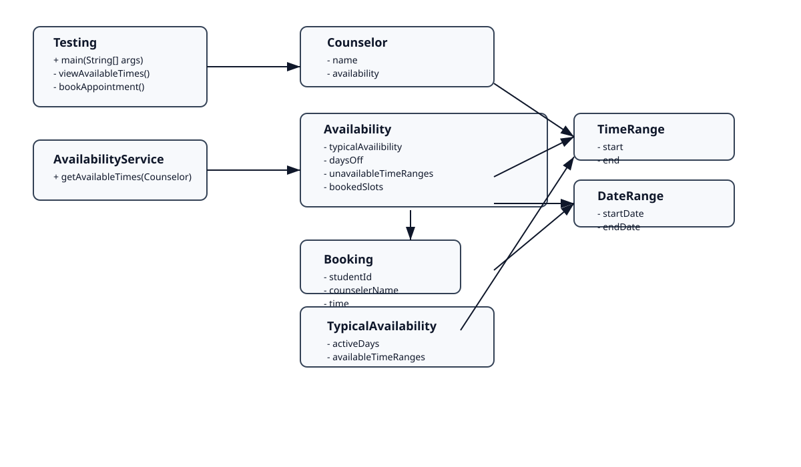

# AP Computer Science A – Final Project
## Software & Systems Development Capstone

Welcome to your **Final Project repository**.

This repository will hold:
- Your complete Java project
- Your project journal and planning artifacts
- Your final, working software product

This is not just an assignment — it is a **capstone software project**.

---

## 📌 Project Overview (Read Carefully)

In this project, you will:
- Design and build a **real piece of software**
- Solve **one real problem** for **one clearly defined user**
- Work using **agile development**
- Show evidence of **professional software practices**
- Use AI responsibly as a planning and support tool

You will leave this course with something you can confidently say:

> “I built this software.”

---

## 🔁 Required Workflow (How You Must Work)

### ✅ Daily GitHub Commits (Required)
You are expected to:
- Make **at least one meaningful commit every class day**
- Write **descriptive commit messages** that explain:
  - What you changed
  - Why you changed it
  - What goal it supports

✅ Good commit messages:
- `Sprint 1: Created Player class and tested constructor`
- `Sprint 2: Implemented 2D map and verified movement logic`

🚫 Poor commit messages:
- `updates`
- `stuff`
- `final version`

Your commit history is **evidence of your thinking and progress**.

---

## 🔁 Agile Development & Sprints

You will complete **4 sprints**.
Each sprint includes:
- Planning
- Building
- Testing
- Feedback and reflection

Each sprint ends with:
- A sprint grade
- A sprint reflection
- Feedback exchanged with peers

🚫 You may NOT complete multiple sprints at once.
✅ Each sprint grade is **final**.

---

## 🧪 Testing Expectations

Testing is required every sprint.

✅ Testing may include:
- Running the program with different inputs
- Print‑based testing
- Driver program testing
- Verifying logic and edge cases

You should be able to explain:
- What you tested
- How you tested it
- What you discovered or fixed

---

## 🗂️ Required Project Components

Your final project must include:

- ✅ Multiple interacting Java classes
- ✅ Encapsulation (`private` fields, appropriate getters/setters)
- ✅ Arrays and/or ArrayLists
- ✅ A purposeful **2D array**
- ✅ A working driver program (`main`)
- ✅ A class diagram matching your final code
- ✅ Clear documentation
- ✅ A program that runs and works

Inheritance and interfaces are optional but encouraged.

---

## 🤖 Using AI (Allowed, With Responsibility)

You may use AI to:
- Organize ideas
- Plan sprints
- Debug code
- Suggest design improvements

You must:
- Document how you used AI
- Review and evaluate AI suggestions
- Understand and explain your final code

AI should act like:
> A junior developer you supervise — not something that builds the project for you.

---

## 📘 Project Journal

All planning, work logs, testing notes, and reflections live in **your project journal**.

If it happened during this project, it should be documented there.

---

## ✅ Final Submission Expectations

By the end of the project:
- Your program should run reliably
- Your technical requirements should be met
- Your code should be readable and organized
- Your repository should look **professional**

---

# ✨ Final Step: README Update (Very Important)

When your project is complete, you must **rewrite this README**
so it reflects **your software**, not the assignment.

Your final README should include:

---

## 🔹 Project Title

Counseling Appointment Booking System

## 🔹 What This Software Does

This program lets a student view available counselor time slots, book a 30-minute appointment, and review booked appointments.

## 🔹 Who It’s For

It is designed for students and school counselors who need a simple way to schedule counseling sessions and avoid double-booking.

## 🔹 How to Run the Program

1. Open a terminal in the project folder.
2. Compile the Java source files from the `src` directory with `javac src/*.java`.
3. Run the driver program with `java -cp src Testing`.
4. Follow the menu to view available times, book an appointment, or see booked appointments.

## 🔹 Technical Overview

- Main classes:
  - `Testing`: driver program and console menu.
  - `Counselor`: stores counselor name and availability.
  - `Availability`: stores typical schedule, days off, unavailable times, and bookings.
  - `AvailabilityService`: computes available appointment slots for the next 7 days.
  - `Booking`: stores student ID, counselor name, and appointment time.
- Key data structures:
  - `List<TimeRange>` for daily available time ranges.
  - `Set<DayOfWeek>` for active work days.
  - `List<Booking>` for booked appointments.
  - `Set<DateRange>` and `Set<TimeRange>` for days off and unavailable periods.
- Program logic:
  - Builds a counselor with a typical daily availability window.
  - Generates 30-minute appointment slots for the next week.
  - Prevents booking already reserved times.
  - Supports viewing available times, booking a slot, and listing booked appointments.

## 🔹 Class Diagram

## 🔹 Known Limitations / Future Improvements

- Currently only supports a single counselor and one default daily time range.
- Appointment data is not saved between runs; adding file persistence would improve usability.
- There is limited input validation and no appointment cancellation flow.
- Future improvements could include multiple counselors, a graphical user interface, and more flexible scheduling rules.

---

## 🎯 Final Reminder

This repository represents **you as a developer**.

Take pride in:
- Your process
- Your commits
- Your code
- Your documentation

Build something real.
Build it thoughtfully.
Build it well.
